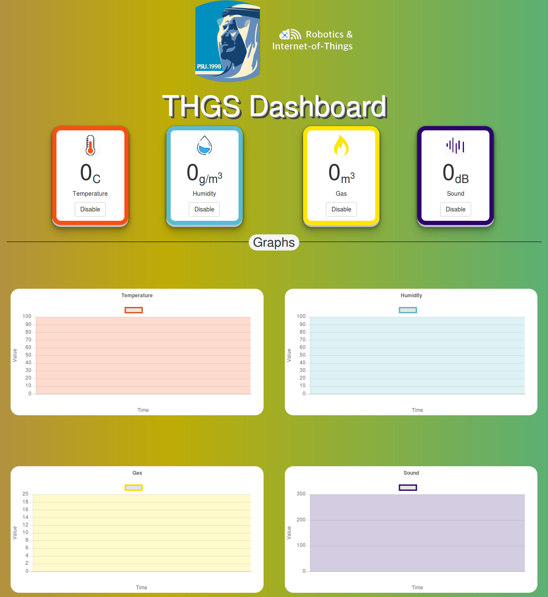

# Arduino Kafka Dashboard

Simple dashboard (follows MVC pattern) for monitoring temperature, humidity, gas, and sound Arduino sensors via using Kafka (stream-processing software platform) 

## Basic Idea

- There are three LoRa nodes, each node send sensor(s) data every 5 seconds.
- LoRa receiver receive data from nodes, and send via serial to gateway.
- There will be two devices one have Kafta and Zookeeper and other one have Kafka connected to Zookeeper of first one. 
- Gateway produces to four topics (temperature, humidity, gas, and sound).
- Gateway will send to client app (which follow MVC pattern) and show it on the page.
- Also, it will be saved to MongoDB.
- Nodes places are shown in Google Map. 

## Architecture

## Usage 

- To run the software, first, run the zookeeper and kafka.
- Run the producer file: `$ node server /kafka/producer.js`.
- Run the server which is considered as a consumer in the same
time: `$ node server /server.js`.
- Now open the browser and write this URL: `127.0.0.1:3006`.
- Run mongodb server: `$ mongod --dbpath ~ /mongo-data/`.
- Now run: `$ node server /kafka/cloud-mongodb.js` to run the
program responsible to storing the data on mongodb.
