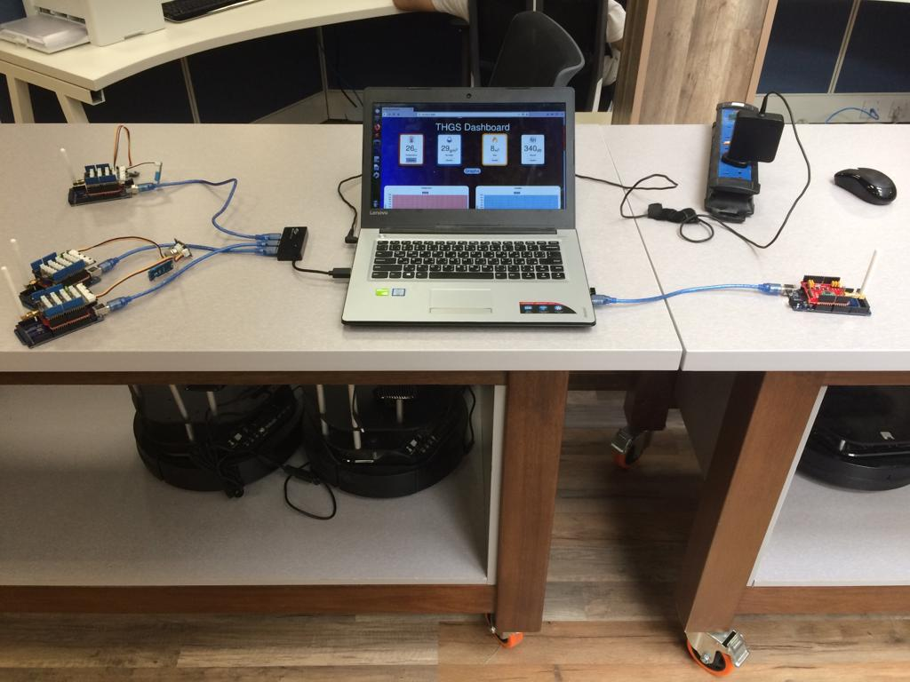
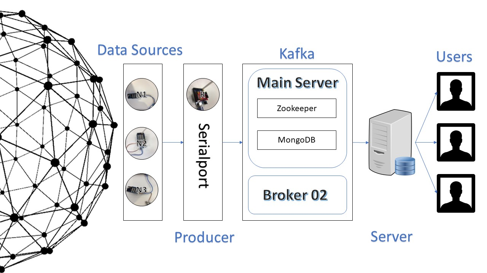

# Arduino Kafka Dashboard

Simple dashboard (follows MVC pattern) for monitoring temperature, humidity, gas, and sound Arduino sensors via using Kafka (stream-processing software platform) 

## About The Project

### Basic Idea

- There are three LoRa nodes, each node send sensor(s) data every 5 seconds.
- LoRa receiver receive data from nodes, and send via serial to gateway.
- There will be two devices one have Kafta and Zookeeper and other one have Kafka connected to Zookeeper of first one. 
- Gateway produces to four topics (temperature, humidity, gas, and sound).
- Gateway will send to client app (which follow MVC pattern) and show it on the page.
- Also, it will be saved to MongoDB.
- Nodes places are shown in Google Map. 

### Technologies Used

- Arduino: for hardware components.
- LoRa: for networking.
- Kafka: for stream-processing.
- HTML, CSS, JS, and NodeJS: for web development.
- MongoDB: for storing data.

## Hardware Components

Sender: Gas + LoRa Shield             |  Sender: Humidity + Temperature + LoRa Shield               |  Sender: Temperature + Sound + LoRa Shield             |    Receiver: LoRa Shield 
:-------------------------:|:-------------------------:|:-------------------------:|:-------------------------:
  |    |    |  

### Architecture

## Usage 

- To run the software, first, run the Zookeeper and Kafka.
- Run the producer file: `$ node server /kafka/producer.js`.
- Run the server which is considered as a consumer in the same
time: `$ node server /server.js`.
- Now open the browser and write this URL: `127.0.0.1:3006`.
- Run mongodb server: `$ mongod --dbpath ~ /mongo-data/`.
- Now run: `$ node server /kafka/cloud-mongodb.js` to run the
program responsible to storing the data on mongodb.

## Authors

- Bassel Saeed
- Abdulrhman AlSharqawi 
- Mohanned Ahmed
